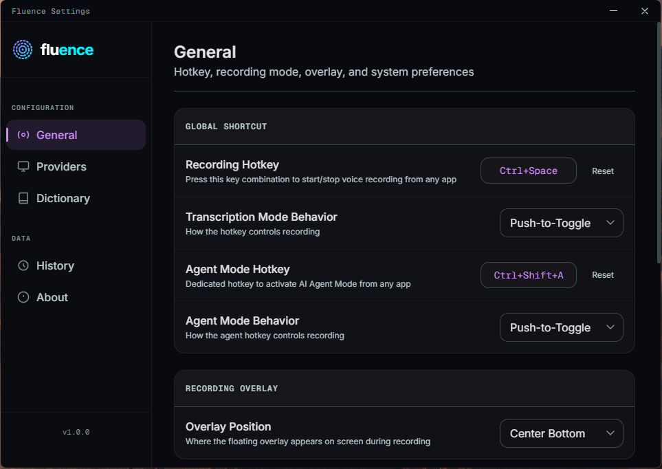
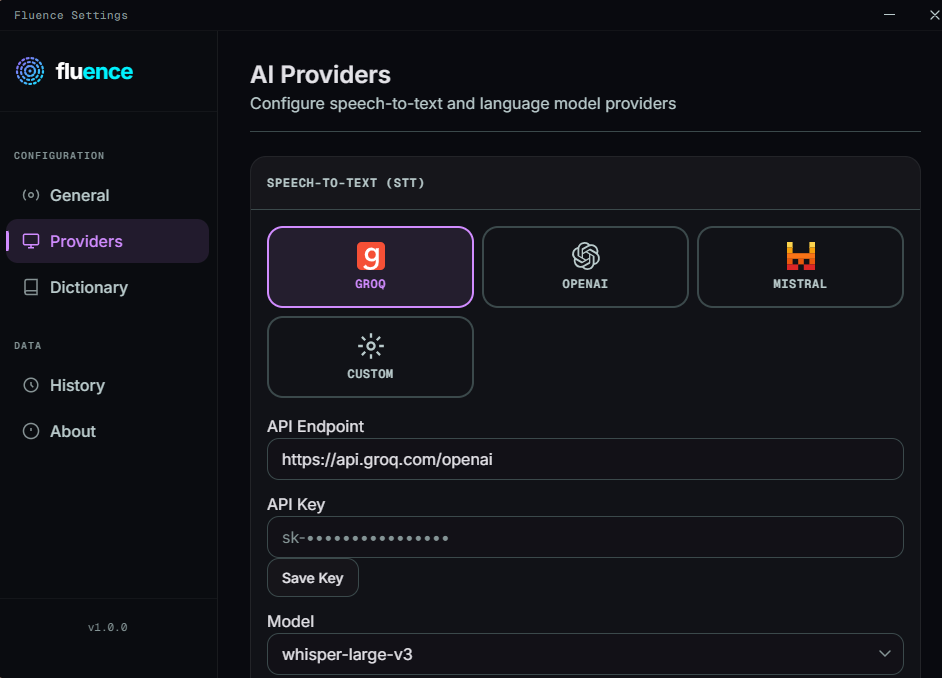
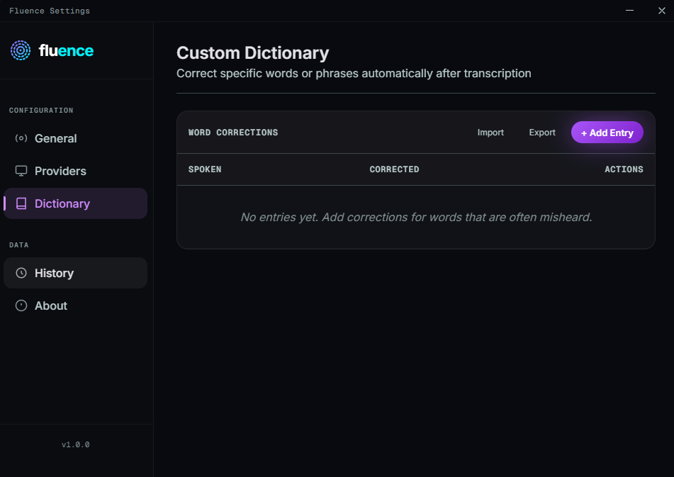

# Fluence 🎙️✨

### *Crystallize your cognition at the speed of thought*

[](https://github.com/raviumeshkulkarni-web/Fluence-Desktop/actions/workflows/publish.yml)
[](https://github.com/raviumeshkulkarni-web/Fluence-Desktop/releases)
[](https://opensource.org/licenses/MIT)
[](https://microsoft.com)
[](https://www.rust-lang.org)

**An AI-powered, system-wide voice typing desktop application for Windows. Works instantly in any app.**

Fluence is a lightweight, privacy-focused Windows application that brings human-level voice transcription to your desktop. Using the **Groq Whisper API (`whisper-large-v3`)** for near-instant, highly accurate transcription, Fluence sits quietly in your system tray and activates via global system hotkeys. When you speak, a floating visualizer overlay tracks your voice, and the transcribed text is injected directly at your cursor in whatever application you are using.

---

## 🎬 Visual Showcase

| 1. General Preferences | 2. AI Providers | 3. Custom Dictionary |
| :---: | :---: | :---: |
|  <br> *Hotkey & Recording preferences* |  <br> *Groq / OpenAI STT and LLM configuration* |  <br> *Automatic text-corrections table* |

---

## 🛠️ Key Desktop Features

* **Global System Shortcuts**: Start and stop recording from any app with configurable hotkeys (default `Ctrl+Shift+Space` for Voice Typing, and `Ctrl+Shift+Space` for AI Agent Mode is configurable).
* **Flexible Recording Modes**: Supports both **Push-to-Toggle** (press once to start, press again to stop) and **Hold-to-Record** (hold key down, speak, release to transcribe) recording styles.
* **AI Polish Assistant**: Choose from multiple language model polish styles to automatically clean up filler words, rewrite text in a professional business tone, convert spoken thoughts into bullet points, or translate dictation into clear English before pasting.
* **Smart Highlight Grabber**: In Agent Mode, the app can automatically grab currently selected text from your active application to use as context for edits, rewrites, or replies without changing your system clipboard.
* **Copy to Clipboard Action**: Command the AI agent to copy its output directly to your system clipboard instead of pasting it, complete with a clean visual success verification.
* **Single-Instance Support**: Built-in architecture that prevents multiple instances of Fluence from running. Launching a second instance automatically focuses and restores the active settings dashboard.
* **Premium Fluent Design**: An elegant, modern settings dashboard featuring branded purple and cyan ambient glows, custom typography, and a glassmorphic waveform visualizer matching Windows 11.
* **Silent & Fast Injection**: Injects transcribed text directly at your cursor via the native Windows `SendInput` keyboard API, preventing focus stealing and clipboard contamination.
* **Secure API Storage**: Integrates with the **Windows Credential Manager** to encrypt and safely store your Groq API keys locally.
* **SQLite History Database**: Keeps a searchable local log of your past dictations for quick reuse or search.
* **Word Corrections Dictionary**: A customizable dictionary that automatically corrects specific phrases or misheard words (e.g., auto-capitalize names or project terms).
* **Windows Auto-Start**: Configure the application to run automatically on Windows boot, operating seamlessly in the background.

---

## 🏆 The Problem & Solution

**The Dictation Bottleneck:**
Built-in Windows dictation (Win+H) is often slow, struggles with accents, handles punctuation rigidly, and sends telemetry data to Microsoft servers. Other streaming voice tools transcribe word-by-word, missing the broader sentence context and frequently making homophone errors.

**The Fluence Approach:**
Fluence captures your audio buffer, applies peak volume normalization to ensure quiet speech is clearly heard, encodes it into a highly optimized 64kbps MP3 stream to minimize network payload, and sends it directly to Groq's high-speed Whisper servers. It transcribes full sentences in under a second with intelligent punctuation and deep context awareness, inserting it instantly at your cursor.

| Feature | **Fluence Windows** | Windows Built-In Speech |
| :--- | :---: | :---: |
| **Accuracy** | **95% - 98%** (Human level) | 80% - 88% |
| **Punctuation** | **Automatic, Contextual & Intelligent** | Rigid / Manual commands |
| **Privacy** | **Open Source (Zero Telemetry)** | Closed Source (Telemetry sent) |
| **Integrates Everywhere** | **Yes (Direct text input injection)** | Limited to specific input boxes |
| **Response Latency** | **Sub-second (~700ms)** | Variable |
| **Custom Dictionary** | **Yes (Auto-corrections)** | Limited |

---

## 🔒 Privacy & Local Security

Fluence is built for users who prioritize privacy and local data security:
* **Zero Telemetry or Phone-Home Code**: No tracking code, analytics scripts, background logging, or usage telemetry. The code is fully open source and verifiable.
* **Direct HTTPS Transmission**: Audio goes directly from your local machine to the API endpoints (e.g., `https://api.groq.com`). No intermediate servers or proxies.
* **Windows Credential Manager Storage**: Your secret API keys are stored using the Windows OS native secure credential store (`wincred`), encrypted via Windows DPAPI.
* **Ephemeral Audio Storage**: Audio recordings are processed on the fly in system memory, converted to MP3, and wiped immediately once transcription is complete.

---

## 🚀 Quick Start & Installation

1. Download the latest installer (`.exe` or `.msi`) from the [Releases](https://github.com/raviumeshkulkarni-web/Fluence-Desktop/releases) tab.
2. Run the installer and open **Fluence**.
3. The onboarding setup wizard will guide you to configure your **Groq API Key**.
4. Press `Ctrl+Shift+Space` in any app, or set your favorite custom shortcut, speak, and press it again to watch your voice convert to text instantly!

---

## 🛠️ Development & Building

To run or build the application from source, you need **Rust** and **Node.js** installed on your system.

1. Clone the repository.
2. Install the dev dependencies:
   ```bash
   npm install
   ```
3. Run the development environment:
   ```bash
   npm run dev
   ```
4. Build the production installers (Wix MSI and NSIS EXE):
   ```bash
   npm run build
   ```
   *The installers will be generated inside `src-tauri/target/release/bundle/`.*

---

## 📄 License
This project is licensed under the MIT License, see the [LICENSE](LICENSE) file for details.
